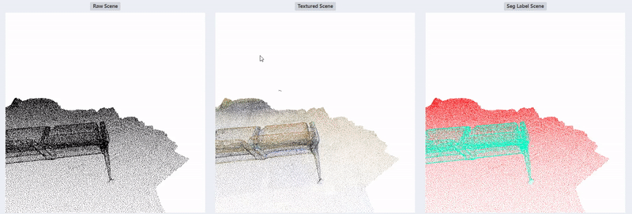
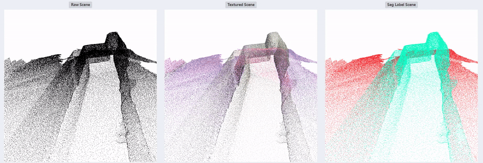
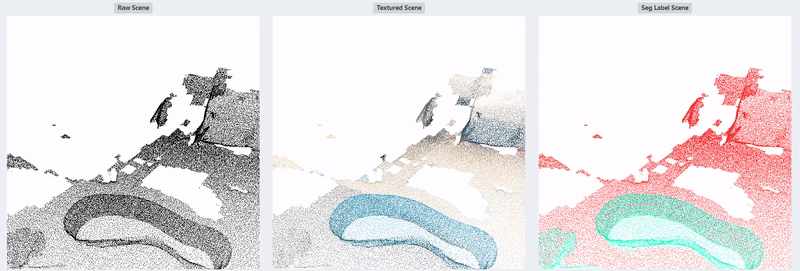
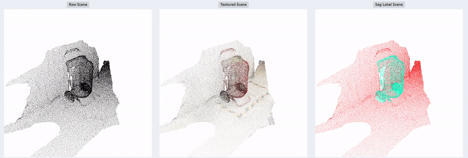

# Scan Point Cloud Seg Dataset

## 1 Running Settings

1. Create your conda environment and activate it.

    ```Shell
    conda create -n <your_env_name> python=3.6 --yes
    conda activate <your_env_name>
    ```

2. Install python package independency.

    ```Shell
    pip install -r requirements.txt
    ```

## 2 Processing Procedure

Branch 1: input points file (.xyz, only xyz) and textured mesh file (.obj), output segmentation label file (.xyz/.npy, xyzrgbl).

> 1. Label foreground points from raw point cloud with tool software such as MeshLab.
> 2. Extract background points and generate point cloud segmentation label file by running `generate_seg_label.py`.
> 3. Generate point cloud segmentation label file with texture information by running `generate_color_points.py`.
> 4. Generate augmented train data and test data by running `generate_train_test_split_data.py`.

Branch 2: input points file (.ply, xyzrgb), output segmentation label file (.xyz/.npy, xyzrgbl).

> TO-DO (refer to `test.py`)

## 3 Display









## 4 To-DO List

1. Seg methods, like Point Transformer...

## 5 Renference

[[1] Python Package: mesh-to-sdf](https://github.com/marian42/mesh_to_sdf)
